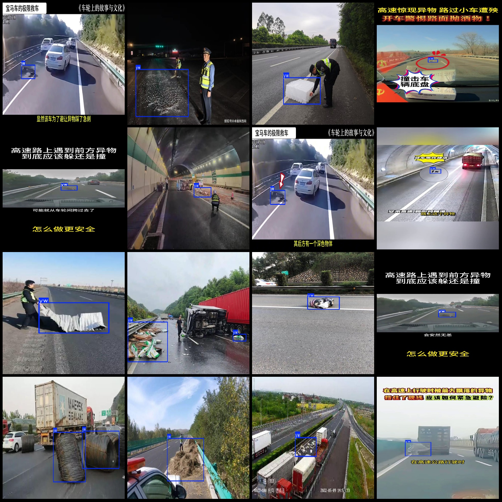

# Smart Traffic Highway Lane Spillover Detection Dataset: VOC+YOLO Format with 232 Images in 1 Category

**Dataset Format:** Pascal VOC format + YOLO format (excluding split paths, only containing jpg images and corresponding VOC format xml files, as well as yolov3.txt files)

- **Number of Image Files (jpg):** 232
- **Number of Annotation Files (xml):** 232
- **Number of Annotation Files (txt):** 232
- **Number of Categories:** 1

The dataset is stored in the repository `firc-dataset`. The category name for the labeled data is "yw". For each category, there are 275 bounding box predictions. The total number of bounding boxes is also 275.

The resolution of the images includes multiple resolutions such as 1280x720, 576x1024, etc.

The annotation tool used is `labelImg`. The annotation rules involve drawing a rectangle around the category.

**Important Notes:**
There are no specific instructions provided for this dataset, but it should be noted that the accuracy of models trained on this dataset or any associated weights/files are not guaranteed by the creators.

**Image Preview:**

**Annotated Example:**

## Images

Here is a pay link on Stripe ( https://buy.stripe.com/3cs8yP7sY87d0vu9AB ). Please contact me lonlonago@foxmail.com after funding $89, and I will send you a complete data files , thank you!

